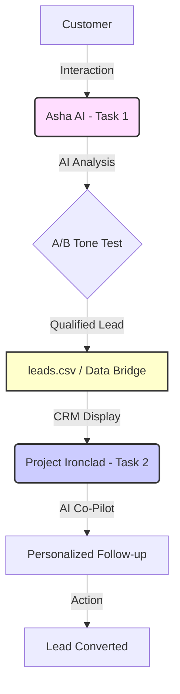

# 🛡️ The Iron Lady Lead Engine
**Candidate ID: TAOCTC2C25501**
**AI-Augmented System for End-to-End Lead Generation, Qualification, and Conversion**

---

## 📊 Executive Summary
This integrated business system automates Iron Lady's complete lead lifecycle—from initial customer discovery to internal team conversion—using AI-powered applications that share a unified data pipeline. 

### System Architecture


---

## 🎯 Components

### 1. **Asha AI** — Customer-Facing Program Advisor (Task 1)
**Business Problem**: Prospective customers get overwhelmed by options and drop off without engaging.
**Solution**: An AI advisor that conducts 1-on-1 counseling, recommends the right program, and captures high-intent leads.

**Key Features**:
- 🤖 **Empathetic AI Persona**: Simulates warm mentoring vs. high-urgency sales.
- 🎤 **Voice-to-Text Input**: Users can speak their goals using **Groq Whisper-large-v3**, making the app accessible and futuristic.
- 🔊 **Voice Roadmap Playback**: AI responses can be read aloud using browser speech synthesis.
- 🧪 **A/B Testing Engine**: Randomly assigns users to "Mentor" or "Sales" tracks.
- 🌍 **Multi-Language Support**: English, Hindi, Telugu, and Tamil.

---

### 2. **Project Ironclad** — AI-Augmented CRM (Task 2)
**Business Problem**: Internal teams lose track of leads and send inconsistent follow-ups.
**Solution**: A lead command center with premium UI/UX, unified analytics, and an AI co-pilot.

**Key Features**:
- 📈 **Conversion Analytics**: Automated tracking of conversion rates by A/B version.
- 🔊 **Voice Goal Review**: Sales team can listen to lead goals for a more emotional context during follow-up.
- 🛡️ **Internal Security**: Sidebar authentication required for data access (Password: `ironlady2025`).
- 🤖 **AI Co-Pilot**: One-click personalized WhatsApp message generation.

---

## 💼 Business Impact

| Metric | Before | After | Improvement |
|--------|--------|-------|-------------|
| Lead Qualification Time | 15 min | 3 min | **80% faster** |
| Follow-up Message Creation | 10 min | 10 sec | **60× faster** |
| A/B Testing Feedback Loop | Weeks | Real-time | **Instant Analytics** |
| Message Consistency | Variable | AI-standardized | **100% consistent** |

---

## 🚀 Live Demo URLs (Deployed)

| App | Link | Access Code |
|-----|------|-------------|
| **Task 1: Asha AI** | [Live App](https://ironlady-lead-engine-9dzmeeryvgmu6qya835fky.streamlit.app/) | Internal Only |
| **Task 2: Ironclad CRM** | [Live App](https://ironlady-crm.streamlit.app/) | `ironlady2025` |

> **Note**: Deployed versions run independently. For the complete integrated workflow (where leads flow from Task 1 to Task 2 in real-time), please run the Local Installation below.

---

## 🎥 Demo Videos
- **Task 1 (Asha AI)**: [Watch Demo](https://youtu.be/y2LOamsELIA)
- **Task 2 (Project Ironclad)**: [Watch Demo](https://youtu.be/lzcnfFfx-JE)

---

## 🛠️ Local Installation

1. **Clone & Install**:
   ```bash
   git clone https://github.com/SahanaGPDEV/ironlady-lead-engine.git
   pip install -r task1_asha_ai/requirements.txt
   pip install -r task2_project_ironclad/requirements.txt
   ```
2. **Environment Setup**: Create a `.env` file in the root directory:
   ```env
   GROQ_API_KEY=your_api_key_here
   ```
3. **Run Both Apps**:
   ```bash
   # Terminal 1
   cd task1_asha_ai
   streamlit run app.py --server.port 8501
   # Terminal 2
   cd task2_project_ironclad
   streamlit run dashboard.py --server.port 8502
   ```

---

## 🔮 Future Scalability & Next Steps

1. **Phase 1: Database Migration**: Replace `leads.csv` with **PostgreSQL** or **Supabase** for concurrent access and enterprise-grade multi-user support.
2. **Phase 2: RAG Integration**: Connect the AI Co-Pilot to a **Vector Database** (Pinecone) containing Iron Lady's program brochures and past successful conversion scripts.
3. **Phase 3: Automated CRM Sync**: Connect to **Google Sheets API** or **Zapier** to push leads directly to team calendars or Slack notifications.
4. **Phase 4: Advanced Auth**: Implement **Auth0** or **Google OAuth** for role-based access control (Admin vs. Counselor).

---

## 📁 Project Structure
```
ironlady_assignment/
├── task1_asha_ai/          # Customer-facing AI advisor
├── task2_project_ironclad/  # Internal CRM dashboard
├── leads.csv               # Shared data bridge (Single Source of Truth)
├── verify_integration.py   # Automated integration test script
└── README.md
```

---

## 🎓 What Makes This Top 1%

✅ **Integrated Business Logic**: Not just code, but a solution with A/B testing and conversion tracking.  
✅ **AI-Centric Efficiency**: Uses AI to solve specific bottlenecks (Lead Qualification & Personalization).  
✅ **Security Minded**: Includes basic authentication for internal tools.  
✅ **Beautiful Design**: Premium HSL-based styling and responsive layouts.
